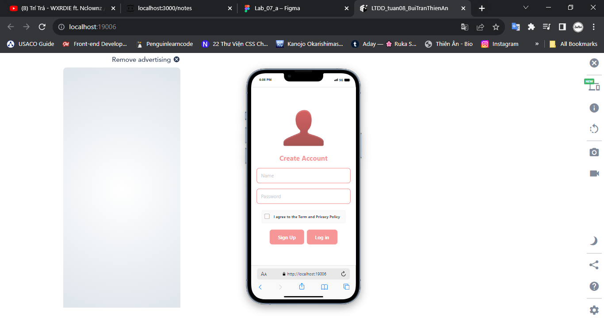
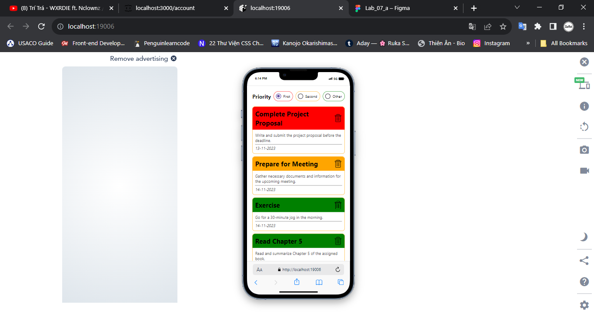

# LTDD_tuan08_BuiTranThienAn
# 1. Screen01: handle loading

# 2. Screen01: fetch donutDB from MockAPI using Axios

# 3. Screen01: handle data transfer when clicking the button 

# 4. Screen01: handle search
- Return filteredData array when a result is found 
- Return empty array when no results are found
- Return originalData when textSearch is empty

